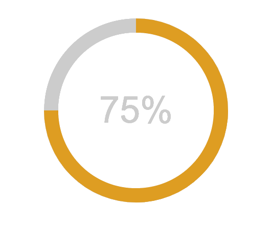

# 

Pure CSS percentage circle
==========================

Such a great project deserves an npm module.

Thanks a lot to André Firchow, who developed this circle. 

For more information go to his blog: http://firchow.net/css3-prozentanzeige-kreis/.

A live demo can be found here: http://circle.firchow.net/

This is a fork from https://github.com/afuersch/css-percentage-circle.

Its been abandoned so I'll maintain this going forward.